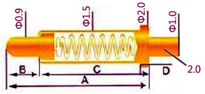
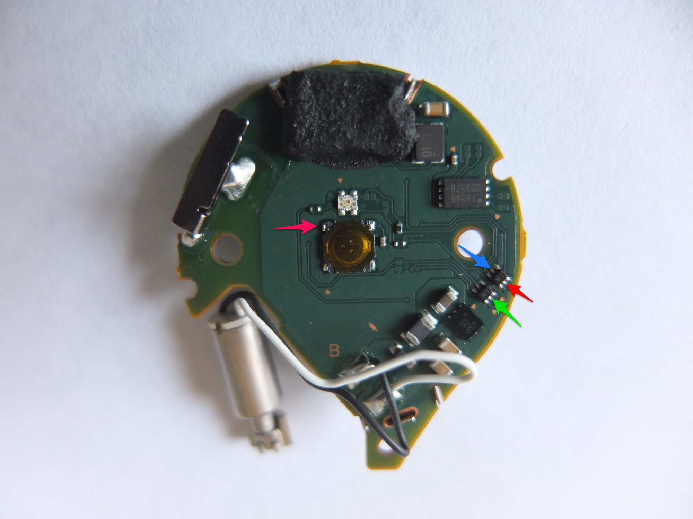
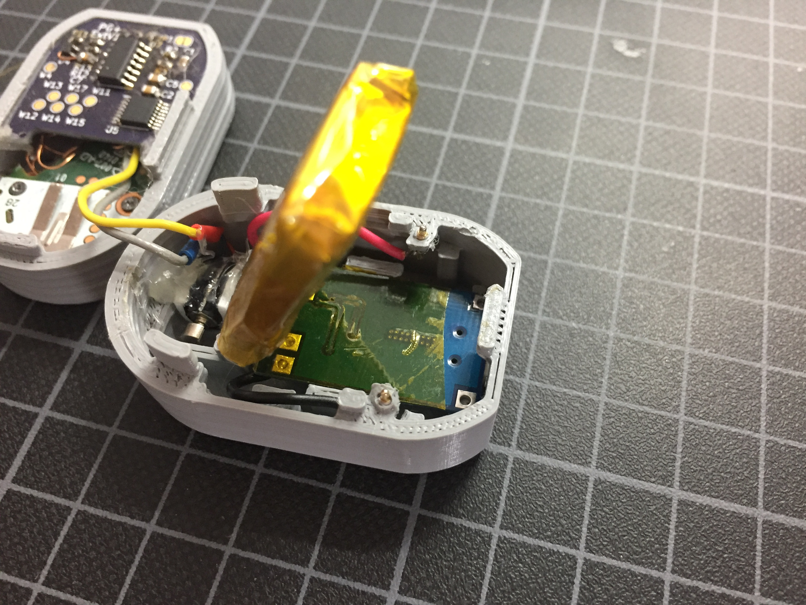
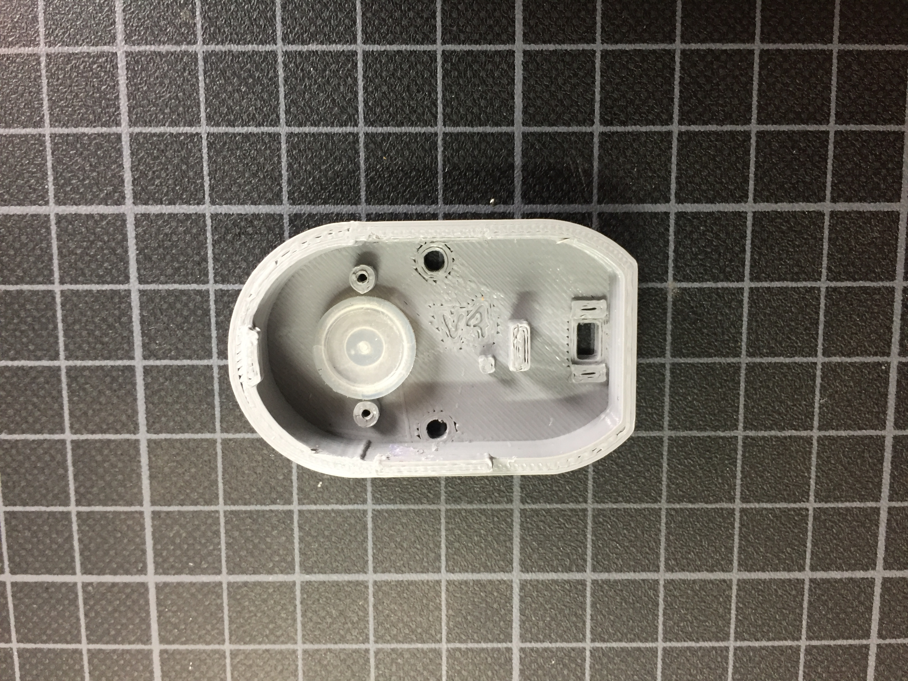
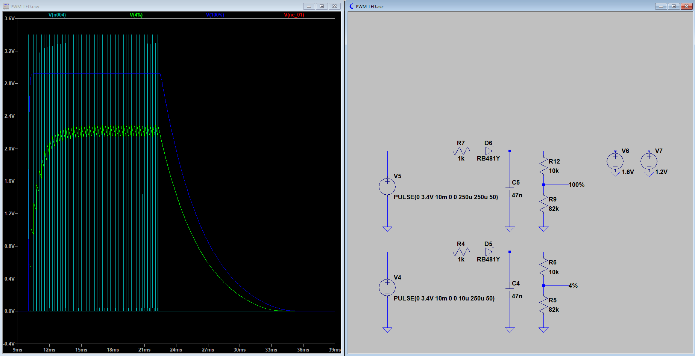

# GoPlusExtender

## Idea
The goal of this project is to have the Go Plus modded in a way where it behaves comparable to the simple mod where you solder the vibration motor to the switch. In that simple mod basically everytime you plus would vibrate it will push the button automatically. At the end this results in constant button presses which on one hand drains the battery and on the other hand also always will push the button in events like "catch/spin succesfull", "item bag full", "connection-errors", etc.  
This project aims to react to Go Plus events in a smart way. Only pushing the button when it is necassary. While implementing that there were other convinient features addied like a rechargable LiPo-battery, low battery indicator, manual/automatic mode select, power save functionalities, change to manual catch mode for new pokemon and -very handy- custom vibration motor control! That enables custom vibration patterns which vibrate the motor in automation mode only when e.q. Go Plus disconnects from smartphone, item bag full or pokemon storage full.

## Concept
Hook into LED driving transistors to analize patterns.  
ATTiny45 reads LED signals, processes them, controlls button and vibration motor. Will be in deep sleep when using manual mode

## Partlist
- Battery - ZIPPY 240mAh 20C Single Cell (hobbyking)
- TP4056 Lithium Battery Charger and Protection Module
- PCB components (see BOM in files)
- additional 5.1k 0603 for charge controller PCB --> exchange R3, limits charge current to save limit around 250mA
- 1x 3D printed case top
- 1x 3D printed case bottom
- 1x 3D printed programmer adapter
- 2x PoGo-Pins small (A=4mm, goes in case, for powering GoPlusExtender from battery), (I got them from Aliexpress, Brand TangDa)
- 7x PoGo-Pins long (A=11.5mm, for programmer), (I got them from Aliexpress, Brand(?) TangDa)

## Schematic
find v1 in files  

## Layout
Due to the tiny footprint the PCB had to be done as 4layer board.  
find v1 in files  

## PCB
Necessary components can be found in PCB_BoM.html  
Everything can still be soldered by hand. Using flux is recommended, especially the Analog Switch with the TSSOP-footprint will be trick otherwise.  

## Go Plus Solderpoints & Wiring
Soldering to the LED drivers is the most challenging part, take your time. In that case I recoommend securing the wires with some hot glue (not good practice... I know).  
o Polarity doesn't matter  
W1 --> GoPlusPower+ (from battery connector)  
W2 --> GoPlusPower- (from battery connector)  
W3 --> BatteryPower+ (from BatteryPCB)  
W4 --> BatteryPower- (from BatteryPCB)  
W5 --> switch (from GoPlus upper left)  
W6 --> GoPlus- (where motor was soldered to GoPlus) o  
W7 --> GoPlus+ (where motor was soldered to GoPlus) o  
W8 --> Motor- (desolder from GoPlus, solder here) o  
W9 --> Motor+ (desolder from GoPlus, solder here) o  
W10 --> LED blue (upper IC, upper middle leg)  
W16 --> LED green (lower IC, lower middle leg)  
W18 --> LED red (upper IC, lower middle leg)  
W11,W12,W13,W14,W17 --> Programmer (careful: here correct polarity is important!)  

## Programmer setup
3D printable programmer adapter in files. Needs PoGo-Pins with length = TBD!!!
W11 --> Uno GND
W --> Uno 13 - white
W --> Uno 12 - brown
W --> Uno 11 - purple
W --> Uno 10 - grey
W12 --> Uno 5V

Set mode to manuel when reprogramming!  
Search online for instructions to use Arduino Uno as programmer for ATTinys.

## Assembly

- 3D print case
- add PoGo-Pins to Case, position might needs to be adjusted a little by heating while soldering (needs case-rework)
- solder wires to ChargePCB
- wrap battery in isolation/kapton tape
(change ChargePCB current resistor to xxx ohms)
- attach battery to charge-PCB as seen in pictures
- put battery unit in bottom part, PCB will snapfit in place
- liftup battery, solder wires to PoGo-Pins

- desolder motor from GoPlus
- solder wires to GoPlus as shown above
- solder GoPlus-ExtenderPCB
- add motor
- solder wires to GoPlus as shown above
- put GoPlus push-button and silicon rubber in top case

- put ExtenderPCB+GoPlus in top case, screw GoPlus in place
- put motor in bottom case, use foam to dampen vibrations, maybe add soft glue to hold in place

## Codebase

### Special variables
SIMULATING --> uncomment for checking code in Atmel Studio. Delays certain actions and skips EEPROM access.  
DEBUGING --> uncomment for upload to ATTiny with debug LED. Error LED will also light up when button gets pressed automatically.

### Main function
main():  
- defines input/output pins  
- defines interrupts  
	- input interrupt monitors LED patterns  
	- timer interrupt gets battery voltage every our (also whenever you power it up)  

### LED analizer functions
BlueHandle()  
GreenHandle()  
RedHandle()  
WhiteHandle()  
YellowHandle()  
- If the corresponding transistors get controlled the inputs at the ATTiny get pulled high, this enables interrupt-routine.  
WaitCount()  
- Counts how often function gets called, button gets pushed after ~30sec of idling to counteract a situation where GoPlus does not react to new Pokemon or Pokestops until useraction occures.  
TrackReset()  
- Reset the counted LED state after initalization or if no new LED-state has been detected for 30sec.  

### Randomized wait functions
This aims to make button presses more human like. There wont be any need to use this, but it's a nice savety feature.  
  
GetSeed()  
- Get & update seed value for randomized reactions.  
MyRandGet() 
- Generate new random-value. Initially based on seed.  
WaitRand()  
- Delay action by randomized time in ms.  

### Switch and motor control functions
SwitchFunc()  
- Controlles switch presses.
MotorFunc()  
- Controlles rumbling motor dependent on auto or manual mode.

### Power save / deep sleep functions
goToSleep()  
- Deep sleep ATTiny to save power.  
adc_init()  
- Enable ADC. Used to measure battery voltage.  
adc_disable()  
- Disable ADC after measurement to save power.  

### Battery monitoring functions
batt_meas()  
- Measure battery voltage.  
batt_state()  
- Read measured voltage. Enable low-battery-LED in 3.1 .. 3.2V range. LED will be disable at lower voltages to avoid additional battery drain.  

## Appendix

### Simulation
Attached in files is the simulation file that can be used with LTSpice. It shows how the PWM pulsed signal of the LED drivers gets smoothed and reduced by the diode and resistor divider to then be read by the ATTiny as a compatible digital input.  

### GoPlus Model
Files contain derived GoPlus model usable as reference for modeling.  
